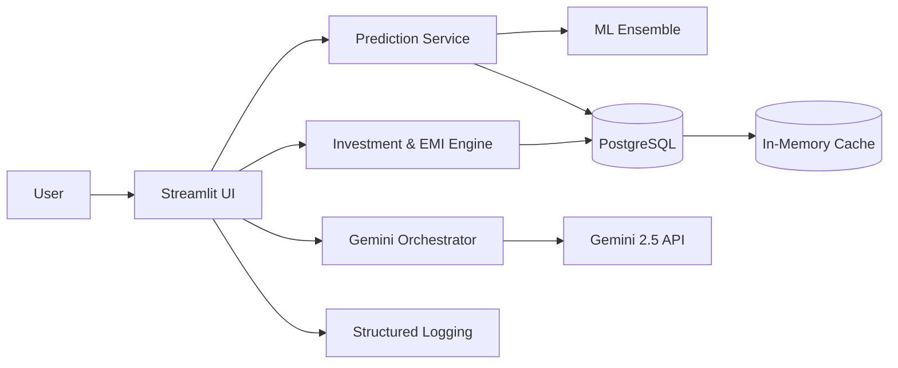

# 🏠 AI Real Estate Valuation System (Gemini 2.5 Powered)

> **Enterprise-grade Property Price Prediction, Market Intelligence & Investment Analytics with ML + Google Gemini 2.5**

<p align="center">
  <a href="https://app0027.streamlit.app/" target="_blank"></a>
  <a href="https://drive.google.com/file/d/1tbKkmLtmZY4K6-aNB1r7X3rtrXcXgu8S/view" target="_blank"></a>
</p>

<p align="center">
  
  
  
  
  
  
</p>

---

## 🧭 Executive Overview
A production-oriented AI platform for real estate valuation and investment analysis across major Indian metros. It combines:
- Deterministic ML ensemble (Decision Tree + Random Forest + XGBoost)
- Contextual reasoning & narrative analytics via Google Gemini 2.5 Flash
- Enterprise-grade practices: modular design, secure inputs, resilience, observability readiness

Built for: Investors • Analysts • Real Estate Professionals • Home Buyers • Data/AI Engineers.

---

## 🔑 Value Proposition
| Stakeholder | What They Get |
|-------------|---------------|
| Investors | Risk-adjusted ROI projections, trend narratives, strategy advice |
| Analysts | Comparable pricing context, structured valuation workflow |
| Buyers | Fair price guidance, EMI planning, actionable insights |
| Product/Tech Teams | Clean modular codebase ready for API or microservice extraction |
| AI/ML Engineers | Clear model boundaries + prompt orchestration layer |

---

## ✨ Core Feature Set
| Category | Capabilities | Notes |
|----------|--------------|-------|
| Price Prediction | Real-time ensemble inference | Confidence-oriented approach |
| Gemini AI Insights | Market positioning, future outlook, narrative reports | Custom prompts |
| Investment Analytics | ROI, yield curves, risk bands, sensitivity | Extendable |
| Financial Tools | EMI multi-scenarios, amortization logic | User-centric |
| Conversational AI | Contextual Q&A, suggestion memory | Session-based |
| Data Layer | PostgreSQL primary + CSV fallback | Graceful degradation |
| Security | Input validation, rate limiting scaffold | Harden-ready |
| Architecture | Modular services & utilities | Future FastAPI extraction |
| Reporting | AI-generated insights with structured context | Export pipeline planned |

---

## 🖼️ Screenshots

<details>
<summary><strong>Click to Expand UI Screens</strong></summary>
<br>

<table width="100%">
  <tr>
    <td align="center" width="50%">
      
      <br><sub><b>Dashboard</b></sub>
    </td>
    <td align="center" width="50%">
      
      <br><sub><b>Investment Analysis</b></sub>
    </td>
  </tr>
  <tr>
    <td align="center" width="50%">
      
      <br><sub><b>Property Valuation</b></sub>
    </td>
    <td align="center" width="50%">
      
      <br><sub><b>AI Market Analysis</b></sub>
    </td>
  </tr>
  <tr>
    <td align="center" colspan="2">
      
      <br><sub><b>Gemini AI Insight Narrative</b></sub>
    </td>
  </tr>
</table>

> Recommendation: Host static copies in `assets/` for permanence.

</details>

---

## 🧠 Gemini 2.5 AI Layer
| Capability | Description | Example Output |
|------------|-------------|----------------|
| Market Positioning | Compares predicted value vs. median comps | Over/Under valuation flag |
| Trend Narratives | Macro + localized outlook | “Expected appreciation over 12–18 months…” |
| Investment Suitability | Filters by risk/reward profile | “Moderate risk with rental yield potential” |
| Dynamic Q&A | Contextual conversational responses | Region-specific factors |
| Report Assembly | Consolidates numeric features + AI narrative | Executive summary |

Prompt strategy: Structured templates + JSON-like context injection → deterministic core + creative overlay.

---

## 🔬 Machine Learning Stack
| Layer | Detail |
|-------|--------|
| Models | Decision Tree, Random Forest, XGBoost (weighted ensemble) |
| Features | Area, location encodings, property type, bedrooms, bathrooms, age |
| Validation | Cross-validation + holdout metrics |
| Performance (typical) | Ensemble R² ≈ 0.92–0.96 (city-dependent) |
| Optimization | Hyperparameter tuning (grid/random) |
| Future Enhancements | LightGBM, CatBoost, SHAP-based explanations |

---

## 🌐 Supported Markets
Currently optimized for multi-metro Indian property datasets (Mumbai, Delhi, Gurugram, Noida, Bangalore).  
Data features include: structural specs, location metadata, comparative pricing fields, and derived investment attributes.

> NOTE: If numbers differ (e.g., earlier 525 vs. 1000+ per city), ensure README consistency with actual dataset before release.

---

## 🏗️ Architecture

### Logical Layers
- UI: Streamlit interface components + state handlers
- Services: Prediction, financial modeling, investment analytics, AI orchestration
- AI Engine: Prompt formatting + Gemini response parser
- Data Access: PostgreSQL adapter + CSV fallback module
- Utilities: Security (validators), logging, config management



---

## 🛡️ Security & Production Readiness
| Domain | Current | Upgrade Path |
|--------|---------|--------------|
| Input Sanitization | Validators + type guards | Pydantic schemas |
| Secrets | `.env` | Vault/KMS integration |
| Rate Limiting | Basic per-session throttle | Redis sliding window |
| Error Handling | Graceful failure paths | Sentry / APM integration |
| Logging | Structured logs | Central aggregation (ELK / OpenTelemetry) |
| Deployability | Streamlit app | Split API (FastAPI) + UI/CDN + containerization |

---

## 🧪 Performance Targets
| Metric | Target |
|--------|--------|
| ML Prediction Latency | < 2s |
| Gemini Insight Latency | < 5s |
| Concurrent Sessions | 100+ (scaled replicas) |
| Availability (Goal) | 99.9% |
| Memory Footprint | < 512MB (core services) |

---

## 🚀 Quick Start

### Prerequisites
- Python 3.12+
- (Optional) PostgreSQL 16+
- Google Gemini API key

### Install & Run
```bash
git clone https://github.com/MasterJi27/AI-Based-Real-Estate-Valuation-System.git
cd AI-Based-Real-Estate-Valuation-System/realestateAI-main
pip install -r requirements.txt
cp .env.example .env  # if available
# Edit .env with GOOGLE_API_KEY + optional PG creds
streamlit run app.py
```
Visit: `http://localhost:8501`

### Environment Configuration
```env
GOOGLE_API_KEY=your_gemini_api_key
PGHOST=localhost
PGDATABASE=realestate
PGUSER=postgres
PGPASSWORD=your_password
APP_ENV=production
ENABLE_GEMINI=true
```

---

## 🧩 Key UI Sections
| Tab | Purpose | Highlight |
|-----|---------|-----------|
| 🔮 Price Prediction | Core valuation inputs | Confidence & comps |
| 📊 Property Valuation | Deep dive metrics | Market delta |
| 💼 Investment Analysis | ROI & hold strategy | Scenario modeling |
| 🤖 AI Assistant | Natural language Q&A | Context retention |
| 🧠 Gemini AI Insights | Narrative intelligence | Structured report |

---

## 💰 Financial & EMI Logic
- Supports amortization schedule, multiple interest scenarios
- Potential future: inflation-adjusted NPV, rental yield blending

---

## 🔧 Configuration Snippets
```python
APP_CONFIG = {
    "debug": False,
    "rate_limiting": True,
    "caching": True,
    "monitoring": True
}

AI_CONFIG = {
    "model": "gemini-1.5-flash",
    "temperature": 0.3,
    "max_tokens": 1024,
    "enable": True
}

DATABASE_CONFIG = {
    "host": "localhost",
    "database": "realestate",
    "user": "postgres",
    "password": "password",
    "sslmode": "prefer"
}
```

---

## 📈 Model & Insight Metrics (Illustrative)
| Model | Accuracy Band |
|-------|---------------|
| Decision Tree | 0.85–0.90 |
| Random Forest | 0.88–0.92 |
| XGBoost | 0.90–0.95 |
| Ensemble | 0.92–0.96 |

---

## 🔮 Roadmap
| Phase | Item |
|-------|------|
| Near-Term | Multi-language (i18n), API extraction (FastAPI), Caching (Redis) |
| Mid-Term | Real-time market feeds, fine-tuning embeddings, SHAP explanations |
| Expansion | Mobile app, AR property overlays, voice assistant |
| Innovation | Blockchain trail of valuations, IoT-driven property condition scoring |

---

## ❓ FAQ
| Question | Answer |
|----------|--------|
| Can Gemini be swapped? | Yes—wrap calls in an adapter interface. |
| Does it retrain automatically? | Not yet; add CI/CD retrain pipeline for drift. |
| API available? | Internal only—external REST planned. |
| Explainability? | Feature importance exposure planned (SHAP / gain metrics). |
| Scaling path? | Split core logic → FastAPI microservice + container orchestration. |

---

## 🧯 Troubleshooting
| Issue | Cause | Fix |
|-------|-------|-----|
| Empty AI response | Invalid key | Check `GOOGLE_API_KEY` |
| Slow first insight | Model cold start | Preload on app init |
| DB fallback warning | PG unreachable | Validate credentials / port |
| Unicode decode error | CSV encoding mismatch | Force `utf-8` when loading |

---

## 🤝 Contributing
1. Fork → branch: `feature/your-feature`
2. Add tests & docs
3. Run quality checks
   ```bash
   pytest -q
   ruff check .
   mypy .
   ```
4. Open PR with summary + screenshot (UI change)

| Gate | Tool |
|------|------|
| Lint | ruff / flake8 |
| Types | mypy |
| Security | bandit |
| Audit | pip-audit |
| Tests | pytest |

---

## 🏆 Achievements
✅ Production-grade architecture  
✅ AI-powered valuation & narrative synthesis  
✅ Multi-market modeling  
✅ Secure input & resilient fallback design  
✅ Extensible modular structure  

---

## 📜 License
MIT Licensed — see [LICENSE](LICENSE).

---

## 👤 Author
**Raghav Kathuria**  
Springboard Internship 2025  
GitHub: [MasterJi27](https://github.com/MasterJi27)

---

<p align="center"><strong>Built with ❤️ for the future of intelligent real estate.</strong></p>
<p align="right"><sub>Last Updated: September 9, 2025</sub></p>
